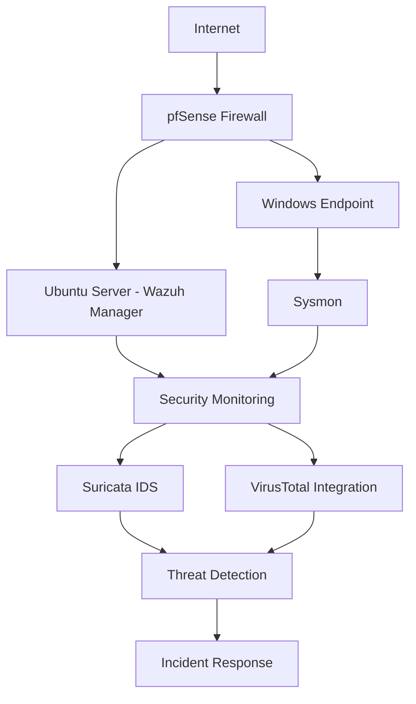

# 🔐 SOC Labs

# Enterprise Security Operations Center (SOC) Laboratory

### Blue Team • Threat Detection • SIEM • Incident Response • Threat Hunting

---

# 📖 Overview

This repository documents my **6-week Security Operations Center (SOC) internship** completed at **Cyberster**, where I designed, deployed, and operated a hands-on enterprise-style Blue Team laboratory.

The objective of this repository is to demonstrate practical SOC skills by documenting every lab, investigation, and technical report completed throughout the internship. The environment was built using industry-standard security technologies including **Wazuh SIEM**, **Suricata IDS**, **pfSense Firewall**, **Windows Event Logging**, and **MITRE ATT&CK** methodologies.

Throughout the internship, I performed security monitoring, alert investigation, log analysis, detection engineering, vulnerability assessment, threat hunting, and incident response while maintaining professional technical documentation for every completed lab.

Rather than serving as a collection of notes, this repository represents a structured portfolio of practical SOC investigations that reflect real-world Security Operations Center workflows.

---

# 🎯 Repository Objectives

- Build an enterprise-style SOC laboratory
- Deploy and configure Wazuh SIEM
- Centralize Windows event collection
- Develop detection rules for security events
- Monitor endpoint and network activity
- Perform alert triage and investigation
- Conduct vulnerability assessments
- Integrate threat intelligence sources
- Map attacker behavior using MITRE ATT&CK
- Practice incident response procedures
- Produce professional technical documentation

---

## 🏗️ SOC Lab Architecture

---

# 🛠️ Technologies

| Category | Technologies |
|-----------|-------------|
| SIEM | Wazuh |
| IDS | Suricata |
| Firewall | pfSense |
| Operating Systems | Ubuntu Linux, Windows |
| Endpoint Monitoring | Sysmon |
| Threat Intelligence | VirusTotal |
| Framework | MITRE ATT&CK |
| Incident Response | NIST SP 800-61 |
| Virtualization | Oracle VirtualBox |

---

# 💻 Core Skills Demonstrated

| Blue Team Operations | Detection Engineering | Incident Response |
|----------------------|----------------------|-------------------|
| Security Monitoring | Detection Rule Development | Alert Investigation |
| Log Analysis | Event Correlation | Incident Triage |
| Threat Hunting | IOC Identification | Evidence Collection |
| Vulnerability Assessment | MITRE ATT&CK Mapping | Technical Documentation |

---

# 🎯 Learning Outcomes

Throughout this internship, I gained practical experience in designing, deploying, and operating a Security Operations Center (SOC) lab using enterprise security technologies. Each weekly lab focused on building practical Blue Team skills through hands-on implementation, investigation, and documentation.

### Key Competencies

- SIEM Deployment & Administration
- Security Monitoring
- Windows Event Log Analysis
- Linux Administration
- Endpoint Visibility with Sysmon
- Detection Rule Development
- Threat Detection
- Alert Triage
- Threat Hunting
- IOC Analysis
- Vulnerability Assessment
- Network Security Monitoring
- Threat Intelligence Integration
- MITRE ATT&CK Mapping
- Incident Response
- Security Investigation
- Technical Documentation
- Incident Response
- Technical Documentation
