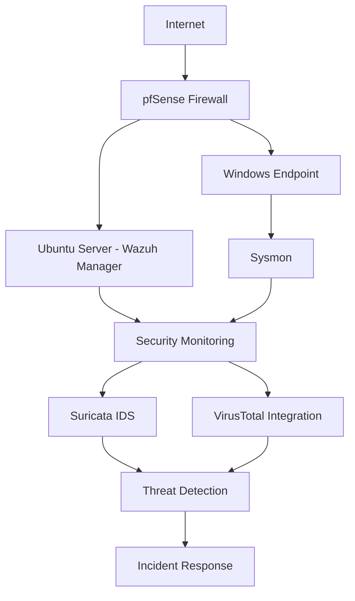

# 🔐 SOC Labs

<div align="center">

# Enterprise Security Operations Center (SOC) Laboratory

### Blue Team • Threat Detection • SIEM • Incident Response • Threat Hunting


</div>

---

# 📖 Overview

This repository documents my **6-week Security Operations Center (SOC) internship** completed at **Cyberster**, where I designed, deployed, and operated a hands-on enterprise-style Blue Team laboratory.

The objective of this repository is to demonstrate practical SOC skills by documenting every lab, investigation, and technical report completed throughout the internship. The environment was built using industry-standard security technologies including **Wazuh SIEM**, **Suricata IDS**, **pfSense Firewall**, **Windows Event Logging**, and **MITRE ATT&CK** methodologies.

Throughout the internship, I performed security monitoring, alert investigation, log analysis, detection engineering, vulnerability assessment, threat hunting, and incident response while maintaining professional technical documentation for every completed lab.

Rather than serving as a collection of notes, this repository represents a structured portfolio of practical SOC investigations that reflect real-world Security Operations Center workflows.

---

# 🎯 Repository Objectives

- Build an enterprise-style SOC laboratory
- Deploy and configure Wazuh SIEM
- Centralize Windows event collection
- Develop detection rules for security events
- Monitor endpoint and network activity
- Perform alert triage and investigation
- Conduct vulnerability assessments
- Integrate threat intelligence sources
- Map attacker behavior using MITRE ATT&CK
- Practice incident response procedures
- Produce professional technical documentation

---

## 🏗️ SOC Lab Architecture



---

# 🛠️ Technologies

| Category | Technologies |
|-----------|-------------|
| SIEM | Wazuh |
| IDS | Suricata |
| Firewall | pfSense |
| Operating Systems | Ubuntu Linux, Windows |
| Endpoint Monitoring | Sysmon |
| Threat Intelligence | VirusTotal |
| Framework | MITRE ATT&CK |
| Incident Response | NIST SP 800-61 |
| Virtualization | Oracle VirtualBox |

---

# 💻 Core Skills Demonstrated

| Blue Team Operations | Detection Engineering | Incident Response |
|----------------------|----------------------|-------------------|
| Security Monitoring | Detection Rule Development | Alert Investigation |
| Log Analysis | Event Correlation | Incident Triage |
| Threat Hunting | IOC Identification | Evidence Collection |
| Vulnerability Assessment | MITRE ATT&CK Mapping | Technical Documentation |

---

# 🎯 Learning Outcomes

Throughout this internship, I gained practical experience in designing, deploying, and operating a Security Operations Center (SOC) lab using enterprise security technologies. Each weekly lab focused on building practical Blue Team skills through hands-on implementation, investigation, and documentation.

### Key Competencies

- SIEM Deployment & Administration
- Security Monitoring
- Windows Event Log Analysis
- Linux Administration
- Endpoint Visibility with Sysmon
- Detection Rule Development
- Threat Detection
- Alert Triage
- Threat Hunting
- IOC Analysis
- Vulnerability Assessment
- Network Security Monitoring
- Threat Intelligence Integration
- MITRE ATT&CK Mapping
- Incident Response
- Security Investigation
- Technical Documentation
- Incident Response
- Technical Documentation

---

# 📚 Weekly Roadmap

Each folder contains the official internship task brief along with my completed technical report documenting the implementation, investigation process, evidence, and key findings.

| Week | Module | Skills Developed |
|:---:|---------|------------------|
| ✅ [Week-01](./Week-01) | SOC Environment Setup | Wazuh Deployment, Linux Administration, Virtualization |
| ✅ [Week-02](./Week-02) | Windows Event Collection & Log Analysis | Sysmon, Event Logs, Detection Rules |
| ✅ [Week-03](./Week-03) | IDS Deployment & Network Monitoring | Suricata IDS, Network Security Monitoring |
| ✅ [Week-04](./Week-04) | Threat Intelligence Integration | VirusTotal, IOC Analysis, Threat Intelligence |
| ✅ [Week-05](./Week-05) | Threat Hunting & Vulnerability Assessment | Threat Hunting, Vulnerability Assessment, MITRE ATT&CK |
| ✅ [Week-06](./Week-06) | Incident Response & SOC Investigation | Alert Triage, Incident Investigation, Reporting |

---

# 📂 Repository Structure

```text
SOC-Labs
│
├── README.md
│
├── Week-01
│   ├── README.md
│   ├── SOC_Report_Week_01.pdf
│   └── SOC_Week1_TaskBrief.docx
│
├── Week-02
├── Week-03
├── Week-04
├── Week-05
└── Week-06
```

---

# 🏆 Highlights

✔ Built a complete enterprise-style SOC lab from scratch

✔ Deployed and configured Wazuh SIEM

✔ Integrated Windows endpoints for centralized log collection

✔ Configured Sysmon for endpoint visibility

✔ Deployed Suricata IDS for network monitoring

✔ Integrated VirusTotal for threat intelligence enrichment

✔ Created custom detection rules for security monitoring

✔ Performed vulnerability assessments

✔ Conducted threat hunting using real-world techniques

✔ Investigated security alerts and correlated events

✔ Applied the MITRE ATT&CK Framework during investigations

✔ Produced professional technical reports with supporting evidence

---

# 🧩 MITRE ATT&CK Coverage

Throughout the internship, security events and attacker behavior were analyzed and mapped to the MITRE ATT&CK Framework wherever applicable.

Examples include:

- Initial Access
- Execution
- Persistence
- Defense Evasion
- Discovery
- Command and Control
- Credential Access
- Collection

---

# 📖 Documentation Standards

Every weekly lab follows a consistent documentation format to ensure clarity and reproducibility.

Each report includes:

- 📌 Objectives
- 🛠️ Lab Setup
- 🔍 Investigation Process
- 📷 Screenshots & Evidence
- 🧠 Technical Analysis
- 📑 Findings
- 📈 Skills Demonstrated

---

# 🎯 Learning Philosophy

This repository emphasizes practical implementation over theoretical concepts.

The primary objective was to develop hands-on experience with enterprise security tools, understand Blue Team workflows, and document each investigation using professional reporting practices similar to those followed in real Security Operations Centers.

---

# 👨‍💻 About Me

I'm **Muhammad Ubaid Roman**, a Computer Science student and aspiring SOC Analyst with a strong interest in Blue Team operations, Digital Forensics, Incident Response, and Security Engineering.

This repository represents my practical work completed during the Cyberster SOC Internship and serves as part of my professional cybersecurity portfolio.

---

# ⚖️ Disclaimer

This repository is intended solely for educational and professional portfolio purposes.

All activities were conducted within authorized laboratory environments as part of the Cyberster SOC Internship.

No unauthorized testing was performed against production systems or third-party infrastructure.

---

<div align="center">

### ⭐ If you found this repository useful, consider giving it a Star.

**Thank you for visiting!**

</div>
